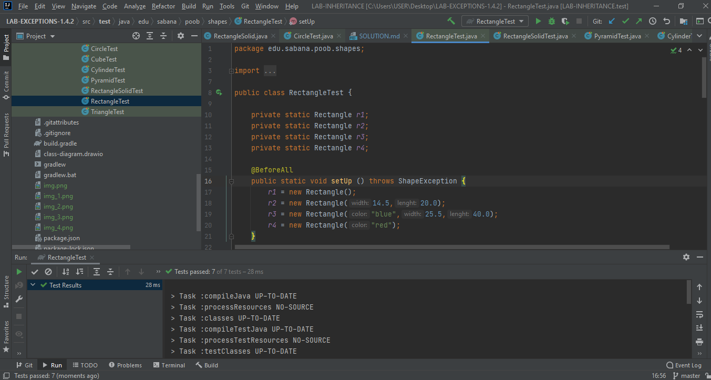

# PARTE 1
Evidencias de Test Circule

## ¿Cómo se lanza una excepción en JAVA? 

Para lanzar una excepción primero se debe tener en cuenta el concepto de throw, este ira junta con la excepción que se quiera lanzar, usualmente se utiliza para cuando el resultad no es el esperado, por ejemplo la edad tiene que ser mayor o igual que cero, si no es así de lanza una excepción diciendo que la edad debe de ser positiva. En código se vería así: (Tomado de https://unipython.com/lanzar-y-capturar-excepciones-en-java/)
## ¿Cómo se propaga una excepción en JAVA? 
      
Al lanzar la excepción, se está interrumpiendo la ejecución del programa, por lo tanto, se busca dentro del código para resolver la situación, si en el código del método en el que se encuentra no halla solución, se propagará hacía el método que haya sido llamada, si en aquel método tampoco esta la solución, se propagará a otro método que haya sido invocado y continuará así hasta encontrar una solución.
## ¿Cómo se captura una excepción en JAVA?
      
Por medio de los bloques de código try- catch o try-finally, dentro del try es donde puede haber una o más sentencias que indiquen lo que se está desarrollando en el programa, mientras que el catch se puede decir que muestra el resultado de ese desarrollo. En el caso del finally, no suele ser muy utilizados dentro de las excepciones porque se utiliza cuando no hay ninguna excepción, de igual forma hace parte de las posibilidades para capturar.
## ¿Cuál es la diferencia en la implementación de las pruebas? ¿Validan lo mismo? 
      
Si validan lo mismo, más la forma para llegar al resultado es diferente, por ejemplo en el primer ejemplo de la explicación del lab, se hace un try, dentro de este se crea un circulo con radio -1 y después se realiza el catch, donde se señala que las dimensiones están mal, mientras que en la segunda parte se crea una excepción, se realiza un throw y como la medida del circulo es 0, se crea un assertEquals donde se señala que las dimensiones están mal.
 
#PARTE 2

Evidencias de CubeTest

Evidencias de CylinderTest

Evidencias de PyramidTest

Evidencias RectangleSolidTest

Evidencias RectangleTest

Evidencias de TriangleTest
